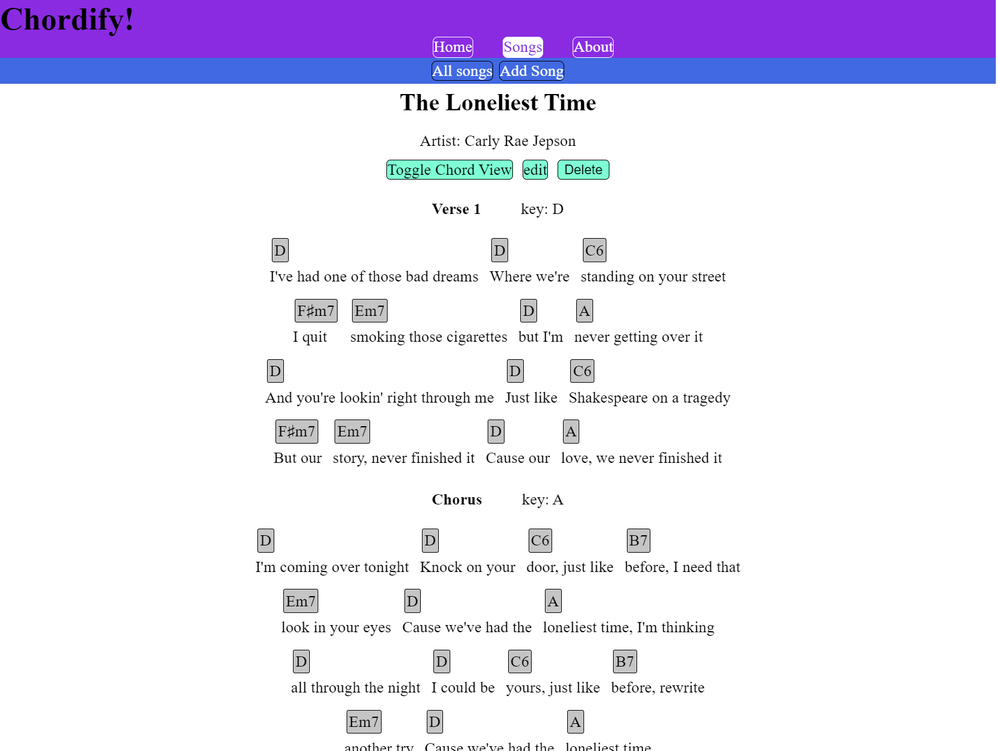

# Chordify!

Chordify is a simple web application for uploading and viewing chord transcriptions of songs and lyrics. This is for musicians who want to play along to songs or analyse their chord structure.

    

Note: Current UI is temporary and is still in development.

## Noteable Features

* Numeric Chords View
    * View chords in numeric form relative to the specified key for easier analysis of chord structures.

* Lyrics
    * Attach lyrics to chords in the song to sing and play along to songs together.

# Acknowledgements

* Chordify is written in Javascript, HTML and CSS
* The Frontend was made using [React](https://react.dev/), [React Router](https://reactrouter.com/en/main)
* The Backend was made using [Nodejs](https://nodejs.org/en), [Express](https://expressjs.com/)
* NoSQL Database used [MongoDB](www.mongodb.com), [Mongoose](https://mongoosejs.com/)